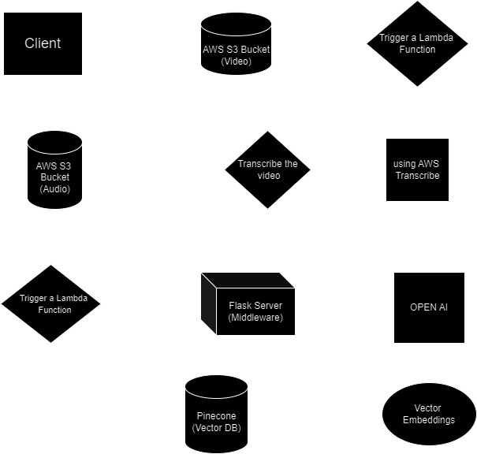
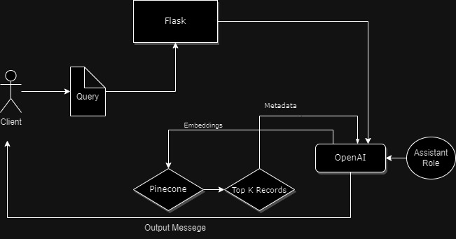

# Motion Ask
> Talk to your data

---
A Bolt 2.0 Hackathon project in which we built a service that will ingest multimedia content though automated pipelines and create a ready to deploy Chat bot. Users can interact with the chat bot and query different kinds of information related to the content of the data.

### Ingestion pipeline for MotionAsk

### Query pipeline for MotionAsk

